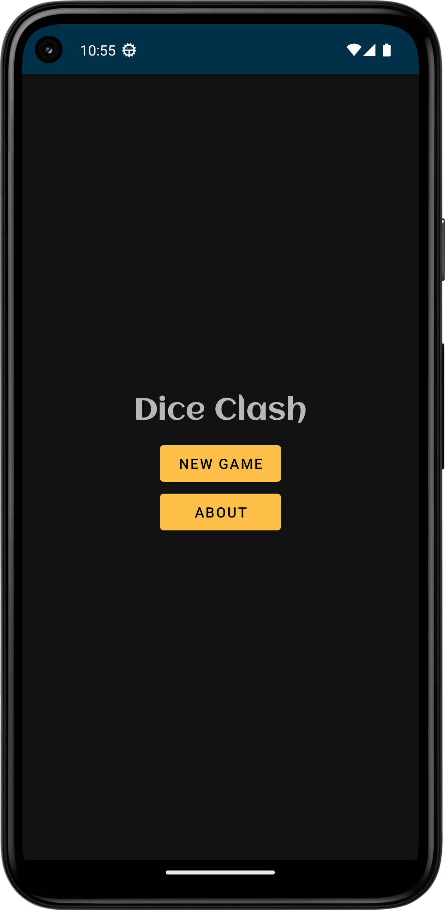

# Dice Clash

An Android mobile game developed using Kotlin. The app features a clean minimal UI, and offers a fun
gameplay experience where the human player can play dice roll against an intelligent computer
player.

  <video src="https://user-images.githubusercontent.com/116336229/227144529-ebdb9538-d1ea-4a3e-8b0e-d9aeeeb5eb9b.mp4"/>

## Features

- Multiple gameplay modes; Computer Intelligent and Random modes
- Ability to survive configuration changes
- Smooth animations throughout the app
- Material design

## Screenshots

|                  Main Screen                  |                 Game Settings                 |                  Game Screen                  |                    Results                    |
|:---------------------------------------------:|:---------------------------------------------:|:---------------------------------------------:|:---------------------------------------------:|
|  |  |  |  |

